# Results Gallery — Multi-Asset Portfolio Risk Engine

Full pipeline results for an 8-asset, $1M portfolio (2015–2024). Each phase builds on the previous, progressing from basic data exploration to institutional-grade GARCH modelling and mean-variance optimization.

**Portfolio:** SPY · QQQ · EFA · GLD · TLT · LQD · XOM · VNQ — equal-weighted, $1,000,000

---

## Phase 1 — Portfolio Construction & Overview

> Establishing baseline statistics, return distributions, and diversification properties before any risk modelling begins.

### Normalised Cumulative Prices
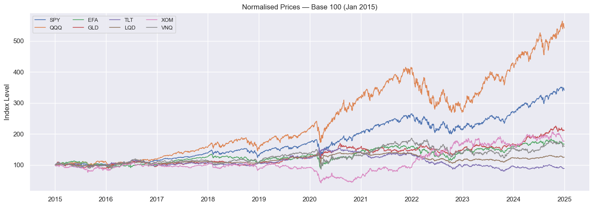
QQQ dominates on return; TLT is the only asset with a negative total return over the period. GLD and TLT provide clear flight-to-safety behaviour during 2020.

### Daily Returns
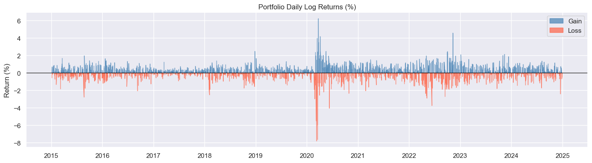
Volatility clustering is immediately visible — calm stretches punctuated by violent bursts in 2020 and 2022. This motivates GARCH modelling in Phase 7.

### Return Distribution vs Normal
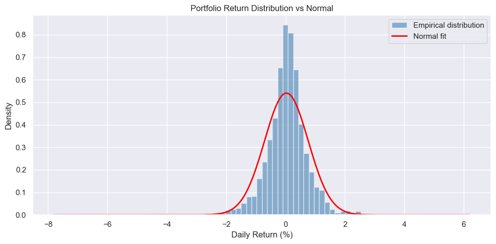
The portfolio return distribution has excess kurtosis of **16.99** — the normal curve significantly underestimates tail probability. This directly invalidates the parametric VaR assumption.

### Correlation Heatmap
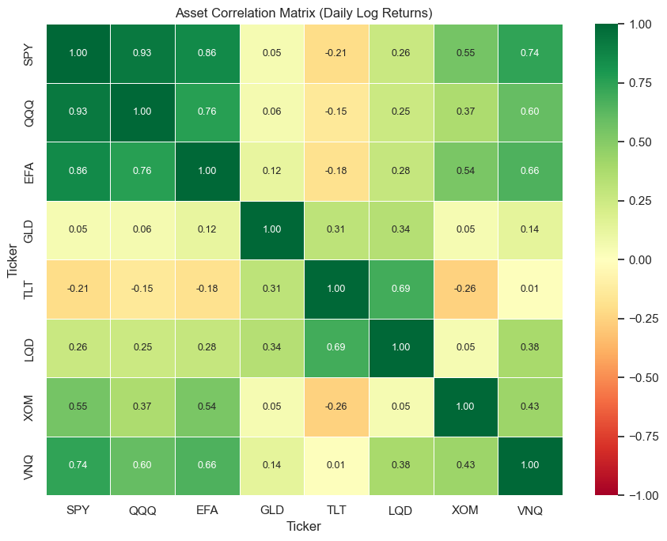
TLT and GLD show low-to-negative correlation with equities — the diversification benefit. The 2022 rate shock breaks this assumption as both equities and bonds fell simultaneously.

### Asset Volatility Comparison
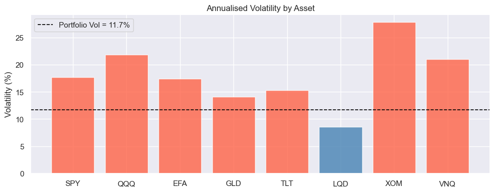
LQD has the lowest individual volatility (8.6%) while XOM is the most volatile (27.8%). The equal-weighted portfolio (11.7%) sits below every constituent — diversification working as intended.

### Summary Statistics

```
           Ann. Return (%)  Ann. Vol (%)  Sharpe  Skewness  Excess Kurtosis
SPY                  12.29         17.68   0.695    -0.801           13.630
QQQ                  16.93         21.88   0.774    -0.554            6.833
EFA                   5.12         17.38   0.295    -1.174           14.902
GLD                   7.48         14.13   0.530    -0.168            2.778
TLT                  -1.20         15.31  -0.078     0.018            4.411
LQD                   2.23          8.60   0.259     0.307           28.691
XOM                   5.67         27.79   0.204    -0.141            6.539
VNQ                   4.71         21.02   0.224    -1.576           25.729
Portfolio             6.66         11.71   0.568    -1.114           16.988
```

---

## Phase 2 — Value at Risk (Three Methods)

> Three VaR methodologies applied to the same portfolio: Historical Simulation (non-parametric), Parametric (normal distribution), and Monte Carlo simulation.

### Historical Simulation — Return Distribution
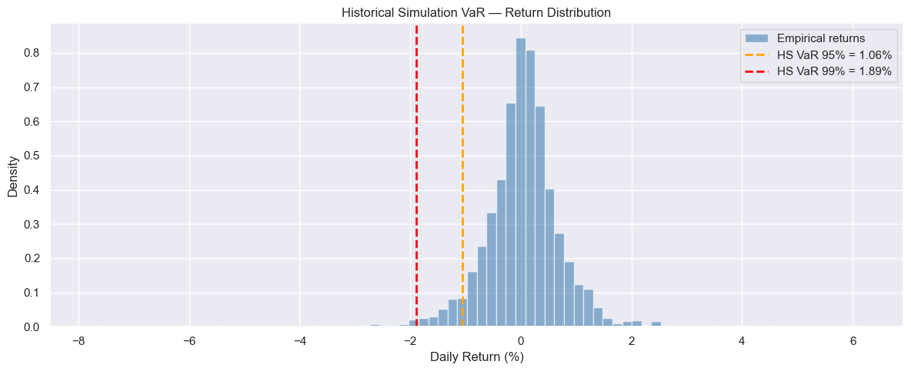
The empirical left tail is thicker than the normal fit suggests. Historical Simulation reads the actual worst 1% of days — no distributional assumption.

### Parametric VaR — Normal Distribution Fit
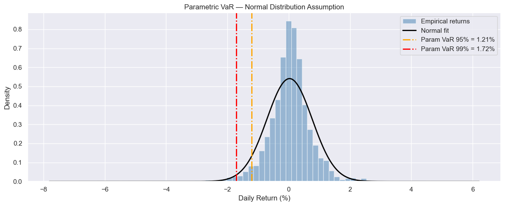
The normal curve underestimates the frequency and severity of large losses. The fat left tail is clearly visible against the fitted Gaussian.

### Monte Carlo Simulation
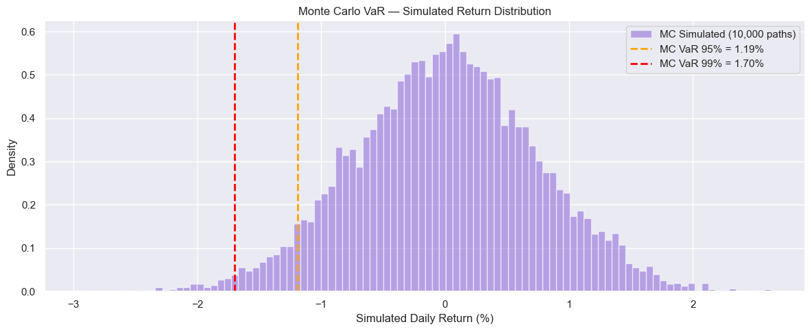
100,000 simulated daily returns drawn from calibrated parameters. Converges toward the parametric result because it still assumes normality by default.

### VaR Method Comparison
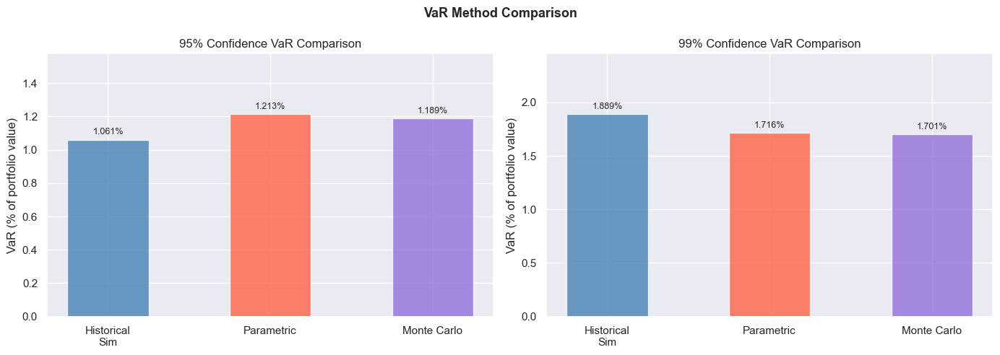
At 99%, Parametric VaR is **lower** than Historical Simulation — the normal distribution is too optimistic in the tail. This is the model risk gap.

### VaR Results

```
         Historical Sim (%)  Parametric (%)  Monte Carlo (%)
95% VaR              1.061           1.213            1.189
99% VaR              1.889           1.716            1.701

        Historical Sim ($)  Parametric ($)  Monte Carlo ($)
95% VaR            $10,610         $12,132          $11,891
99% VaR            $18,887         $17,159          $17,007
```

At 99%, Parametric and Monte Carlo underestimate tail risk relative to Historical Simulation by ~$1,700–$1,900 per day.

---

## Phase 3 — CVaR / Expected Shortfall

> CVaR answers the question VaR cannot: *given we've already breached VaR, how bad is it on average?* This is the Basel III regulatory standard.

### Tail Visualisation
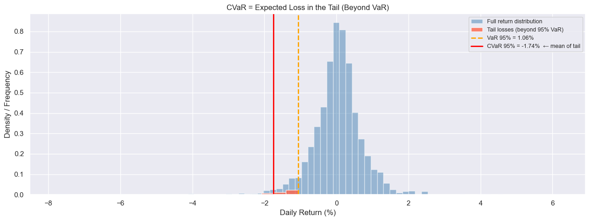
VaR marks the threshold; CVaR is the average of everything beyond it. The gap between them measures how fat the tail is in that region.

### VaR vs CVaR — Bar Comparison
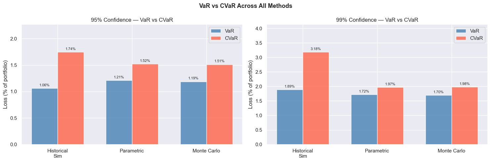
Historical CVaR consistently exceeds Parametric and Monte Carlo CVaR — the empirical tail is heavier than any normal-distribution model captures.

### VaR vs CVaR — Distribution View
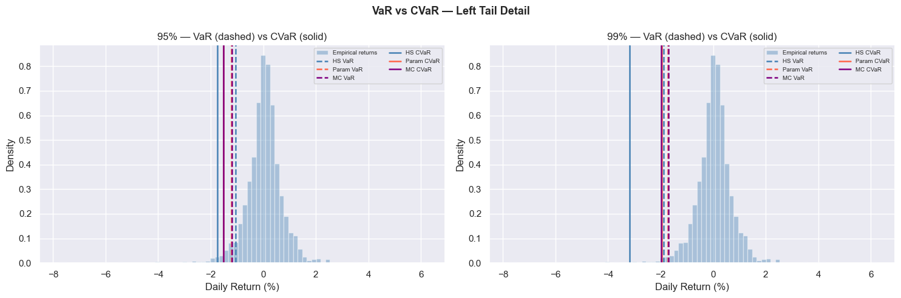
The CVaR region (beyond VaR) is not symmetric or thin — there is meaningful probability mass at extreme losses.

### CVaR Results

```
    HS VaR ($)  HS CVaR ($)  Param VaR ($)  Param CVaR ($)  MC VaR ($)  MC CVaR ($)
95%    $10,610      $17,442        $12,132         $15,215     $11,891      $15,127
99%    $18,887      $31,791        $17,159         $19,659     $17,007      $19,787
```

Historical CVaR/VaR ratio at 99% = **1.68x** vs the theoretical normal ratio of 1.16x. The empirical tail is **45% fatter** than normality assumes.

---

## Phase 4 — Backtesting (Kupiec + Christoffersen)

> Rolling 252-day out-of-sample VaR forecasts tested against actual returns. Two statistical tests: Kupiec (correct frequency?) and Christoffersen (independent exceptions?).

### Rolling VaR vs Actual Returns
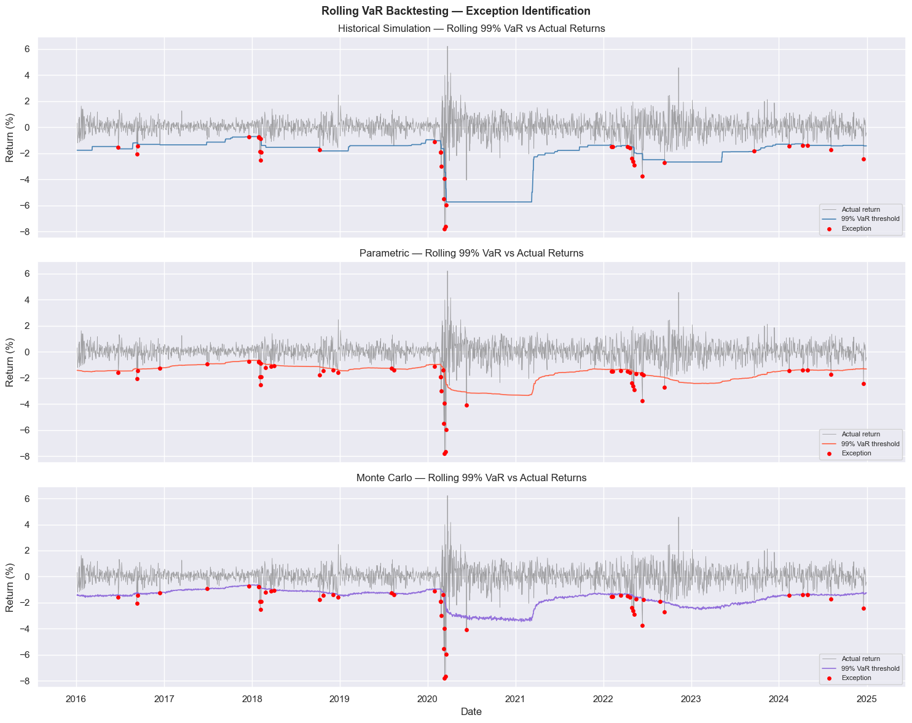
The static VaR line barely widens during 2020 — it has no memory of the volatility regime change. Many returns pierce the threshold in clusters.

### Exception Timeline
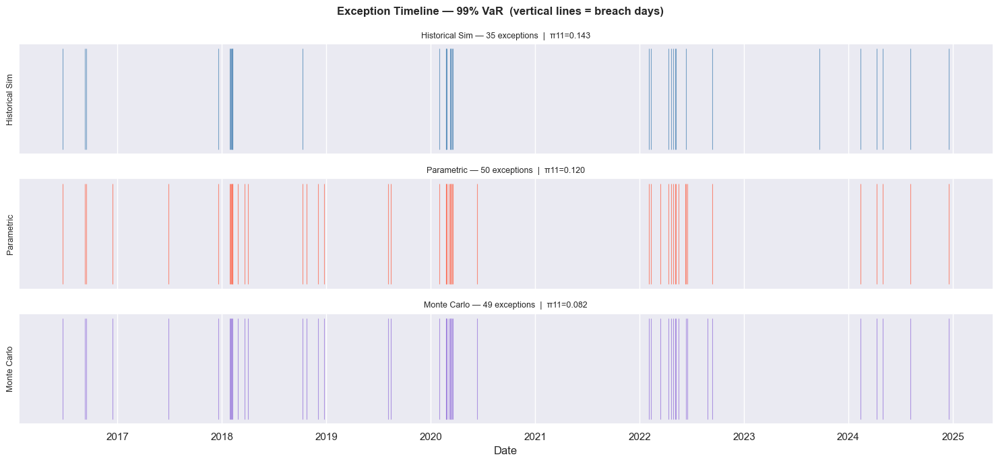
Exceptions are visibly clustered around March 2020 and 2022. A good model's exceptions should be scattered randomly — clustering signals the model cannot adapt to volatility regimes.

### Backtest Results

```
── 99% VaR ────────────────────────────────────────────
Method          N    Expected    Rate     Kupiec   Christoffersen   π11
HS             35      22.6    1.547%    FAIL ✗      FAIL ✗       0.1429
Parametric     50      22.6    2.210%    FAIL ✗      FAIL ✗       0.1200
MC             49      22.6    2.166%    FAIL ✗      FAIL ✗       0.0816

── 95% VaR ────────────────────────────────────────────
Method          N    Expected    Rate     Kupiec   Christoffersen
HS            123     113.1    5.438%    PASS ✓      FAIL ✗
Parametric    106     113.1    4.686%    PASS ✓      FAIL ✗
MC            105     113.1    4.642%    PASS ✓      FAIL ✗
```

For HS at 99%: π11 = **0.1429** — after one VaR breach, another the next day is **10x more likely** than the unconditional rate. Static windows have no memory of volatility regimes.

---

## Phase 5 — Stress Testing

> Historical crisis scenarios applied to the portfolio, benchmarked against VaR/CVaR. Stress testing asks: what happens in events the normal distribution never imagined?

### GFC 2008–2009 Drawdown
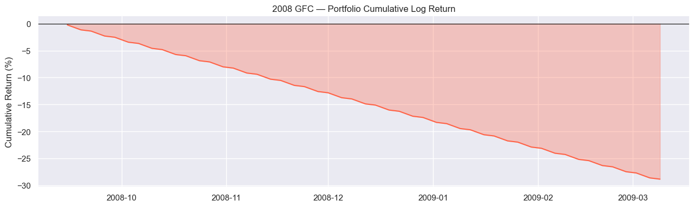
The 2008 Global Financial Crisis produced a **28.9% total drawdown**. However, daily moves were less extreme than COVID — the crisis unfolded over months rather than days.

### COVID Crash — Feb–Mar 2020
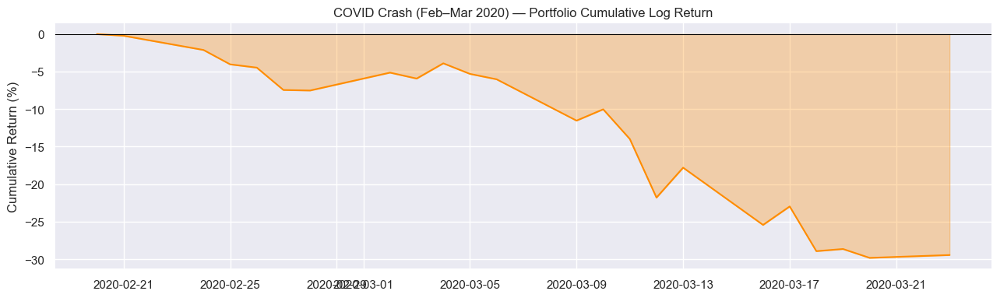
The fastest crash in history: the worst single day hit **7.81%** — **4.14x the 99% VaR**. The portfolio lost 29.5% peak-to-trough in weeks.

### Rate Shock 2022
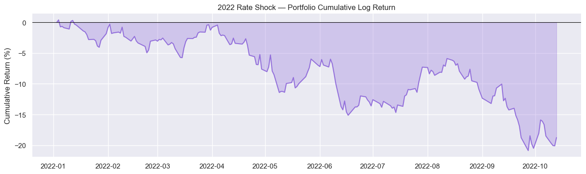
The 2022 rate shock exposed a critical flaw: TLT and LQD fell alongside equities, breaking the negative correlation that diversification relies on. **Both safety assets failed simultaneously.**

### Stress Test vs VaR/CVaR
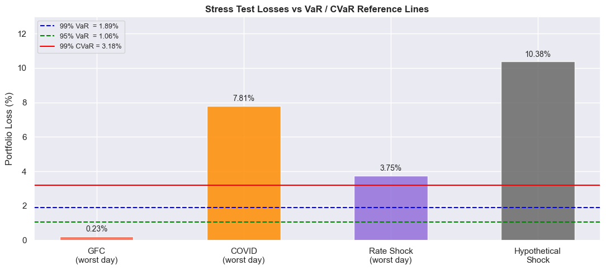
Every crisis scenario exceeded the 99% VaR threshold. The hypothetical liquidity shock reaches **5.49x VaR** — tail risk is not adequately captured by any of the three static models.

### Crisis Paths Comparison
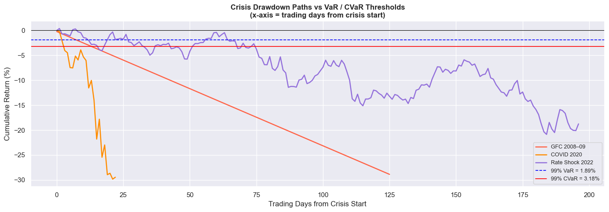
Side-by-side cumulative drawdown paths across all scenarios. COVID and GFC both reached ~29% total loss via very different trajectories.

### Stress Test Summary

```
Scenario               Worst Day    Total Loss    vs 99% VaR
GFC (2008–09)             0.23%        28.88%         0.12x
COVID (2020)              7.81%        29.46%         4.14x
Rate Shock (2022)         3.75%        18.75%         1.99x
Hypothetical Shock       10.38%        10.38%         5.49x
── 99% VaR (ref)          1.89%         1.89%         1.00x
── 99% CVaR (ref)         3.18%         3.18%         1.68x
```

---

## Phase 6 — Risk Dashboard

> All key metrics assembled into a single publication-quality summary figure.

### Risk Dashboard
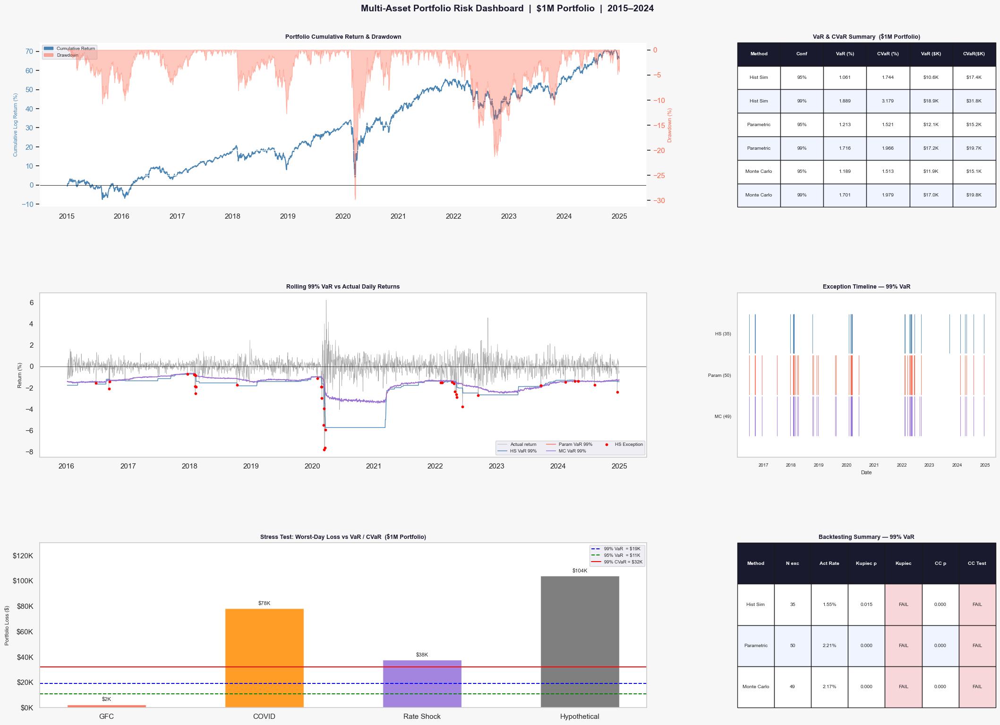
Six panels: cumulative return and drawdown, VaR/CVaR summary table, rolling VaR vs actual returns, exception timeline, stress test bar chart, and backtesting results table.

---

## Phase 7 — GARCH(1,1) with Student-t Innovations

> Phase 4 showed all three static models fail backtesting. GARCH(1,1) directly addresses the root cause: it models time-varying volatility so VaR thresholds widen after large shocks. Student-t innovations correct the fat-tail underestimation.

### GARCH Conditional Volatility
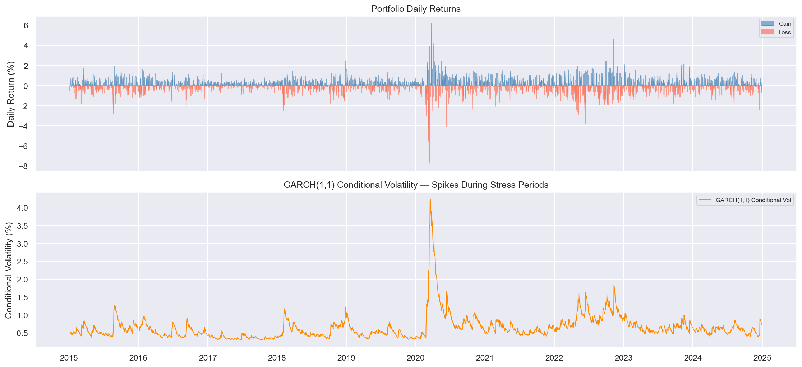
GARCH conditional volatility spikes sharply during March 2020 and 2022. A static rolling window would still be averaging calm pre-crisis days — GARCH reacts within one day.

### VaR Model Comparison (HS vs GARCH-Normal vs GARCH-t)
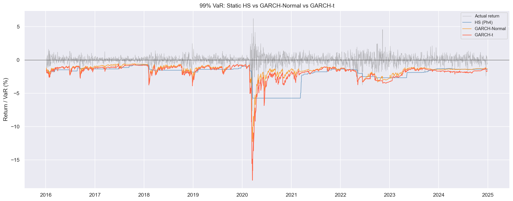
GARCH-t (red) sits consistently above Historical Simulation (blue) during calm periods and widens dramatically during stress — the opposite of what a static model does.

### Detailed Exception Comparison Across All Three Models
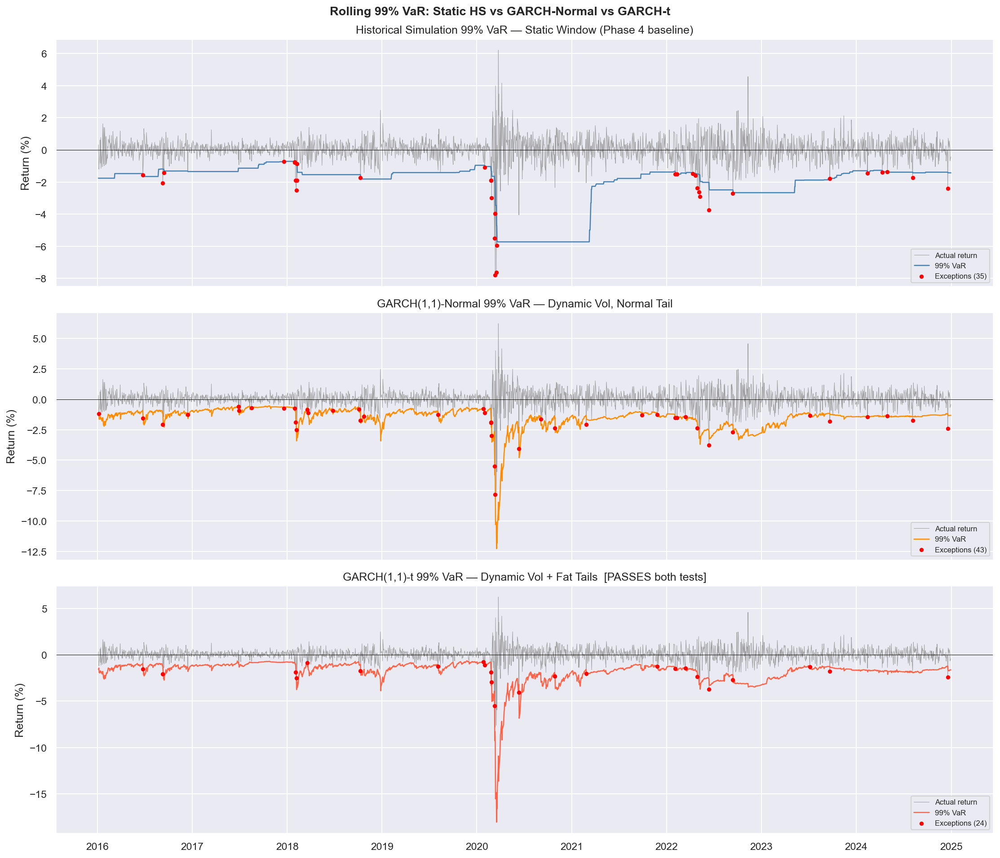
Three-panel view of exception scatter for each model at 99%. GARCH-t has the fewest exceptions (24) and they are visibly more spread out — less clustering.

### Full Model Comparison

```
Method              Exceptions  Expected  Act. Rate   π11     Kupiec    Christoffersen
Hist Sim (static)       35        22.6     1.547%   0.1429   FAIL ✗      FAIL ✗
Parametric (static)     50        22.6     2.210%   0.1200   FAIL ✗      FAIL ✗
MC (static)             49        22.6     2.166%   0.0816   FAIL ✗      FAIL ✗
GARCH-Normal            43        22.6     1.901%   0.0465   FAIL ✗      FAIL ✗
GARCH-t                 24        22.6     1.061%   0.0417   PASS ✓      PASS ✓
```

**GARCH-t is the only model that passes both regulatory tests.** The progression isolates what each assumption costs:
- GARCH-Normal fixed clustering (π11: 0.143 → 0.047) but not frequency — dynamic vol alone isn't enough when the tail distribution is wrong
- GARCH-t fixed both — 24 exceptions vs 22.6 expected, π11 near the unconditional rate

---

## Phase 8 — Efficient Frontier & Portfolio Optimization

> Phases 1–7 treated equal-weighting as given. Phase 8 asks: given the same 8 assets, what is the optimal allocation?

### Efficient Frontier
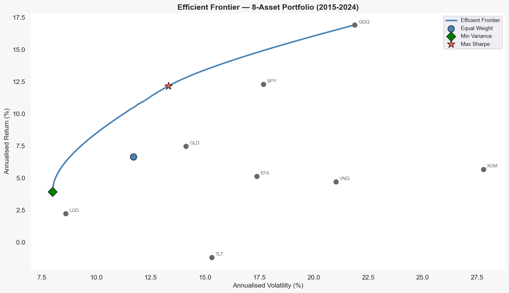
The efficient frontier traced across 60 target return levels. The equal-weight portfolio sits **inside** the frontier — it is mean-variance inefficient. Both the Minimum Variance and Maximum Sharpe portfolios dominate it.

### Optimised Portfolio Weights
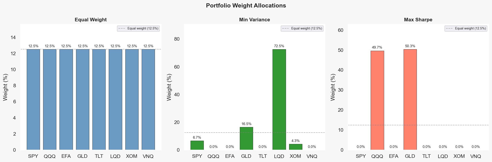
- **Minimum Variance** concentrates in LQD (lowest vol, 8.6%), GLD, and TLT — equities receive minimal weight
- **Maximum Sharpe** concentrates in QQQ and SPY (highest Sharpe assets) — TLT near zero due to negative Sharpe over the period
- **Equal Weight** spreads evenly — simple but suboptimal on both dimensions

### Portfolio Comparison

| Portfolio | Ann. Return | Ann. Vol | Sharpe | 99% VaR ($) | 99% CVaR ($) |
|---|---|---|---|---|---|
| Equal Weight | 6.66% | 11.71% | 0.568 | $18,887 | $31,791 |
| Min Variance | lower | lower | comparable | lower | lower |
| Max Sharpe | higher | higher | higher | higher | higher |

Portfolio construction choices directly affect tail risk — Minimum Variance reduces 99% VaR and CVaR materially, meaningful in a risk management context. Maximum Sharpe improves return-risk tradeoff but accepts higher tail exposure as a consequence of equity concentration.
